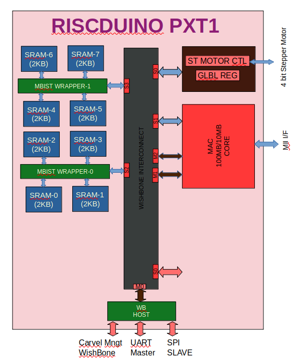

```
  Riscduino Peripheral Extension-1 SOC


Permission to use, copy, modify, and/or distribute this soc for any
purpose with or without fee is hereby granted, provided that the above
copyright notice and this permission notice appear in all copies.

THE SOC IS PROVIDED "AS IS" AND THE AUTHOR DISCLAIMS ALL WARRANTIES
WITH REGARD TO THIS SOC INCLUDING ALL IMPLIED WARRANTIES OF
MERCHANTABILITY AND FITNESS. IN NO EVENT SHALL THE AUTHOR BE LIABLE FOR
ANY SPECIAL, DIRECT, INDIRECT, OR CONSEQUENTIAL DAMAGES OR ANY DAMAGES
WHATSOEVER RESULTING FROM LOSS OF USE, DATA OR PROFITS, WHETHER IN AN
ACTION OF CONTRACT, NEGLIGENCE OR OTHER TORTIOUS ACTION, ARISING OUT OF
OR IN CONNECTION WITH THE USE OR PERFORMANCE OF THIS SOC.
```
# Table of contents
- [Overview](#overview)
- [Block Diagram](#block-diagram)
- [Key Feature](#key-features)

# Overview
This is chip is add-on to our Riscduino SCORE/DCORE/QCORE Chip set. As there are no free space in the previous chip and this chip
will be host additional function like mac core, stepper motor and new feature as needed.
This project uses only open source tool set for simulation,synthesis and backend tools.  The SOC flow follow the openlane methodology and SOC environment is compatible with efabless/carvel methodology.


# Block Diagram
<table>
  <tr>
    <td  align="center"></td>
  </tr>
</table>

# Key features
```
    * Open sourced under Apache-2.0 License (see LICENSE file) - unrestricted commercial use allowed.
    * 100MB/10MB MAC core
    * 4 pin Stepper Motor controller
    * 8 x 2KB SRAM with MBIST controller
    * Open-source tool set
       * simulation - iverilog
       * synthesis  - yosys
       * backend/sta - openlane tool set
    * Verification suite provided.
```

# MPW Shuttle on Riscduino 

<table>
  <tr>
    <td  align="center"> MPW</td> 
    <td  align="center"> Tape-out</td>
    <td  align="center"> Project Name</td>
    <td  align="center"> Project Details</td>
    <td  align="center"> Github</td>
    <td  align="center"> Efabless</td>
    <td  align="center"> Tapeout Link</td>
  </tr>
  <tr>
    <td  align="center"> MPW-2 </td> 
    <td  align="center"> 18-June-2021  </td>
    <td  align="center"> YiFive</td>
    <td  align="center"> Single 32bit RISCV core without cache + SDRAM Controller + WB Interconnect</td>
    <td  align="center"> <a href="https://github.com/dineshannayya/yifive">Link</a></td>
    <td  align="center"> <a href="https://platform.efabless.com/projects/152">Link</a></td>
    <td  align="center"> <a https://foss-eda-tools.googlesource.com/third_party/shuttle/sky130/mpw-002/slot-007">Link</a></td>
  </tr>
  <tr>
    <td  align="center"> MPW-3 </td> 
    <td  align="center"> 15-Nov-2021  </td>
    <td  align="center"> Riscduino</td>
    <td  align="center"> Single 32bit RISCV core without cache + Onchip SRAM + WB Interconnect</td>
    <td  align="center"> <a href="https://github.com/dineshannayya/riscduino">Link</a></td>
    <td  align="center"> <a href="https://platform.efabless.com/projects/385">Link</a></td>
    <td  align="center"> <a href="https://foss-eda-tools.googlesource.com/third_party/shuttle/sky130/mpw-003/slot-013">Link</a></td>
  </tr>
  <tr>
    <td  align="center"> MPW-4 </td> 
    <td  align="center"> 31-Dec-2021  </td>
    <td  align="center"> Riscduino-R1</td>
    <td  align="center"> Single 32bit RISCV core with cache + Onchip SRAM + WB Inter Connect</td>
    <td  align="center"> <a href="https://github.com/dineshannayya/riscduino">Link</a></td>
    <td  align="center"> <a href="https://platform.efabless.com/projects/575">Link</a></td>
    <td  align="center"> <a https://foss-eda-tools.googlesource.com/third_party/shuttle/sky130/mpw-004/slot-014">Link</a></td>
  </tr>
  <tr>
    <td  align="center"> MPW-5 </td> 
    <td  align="center"> 21-Mar-2022  </td>
    <td  align="center"> Riscduino-DCORE (D0)</td>
    <td  align="center"> Dual 32bit RISCV core with cache + Onchip SRAM+ WB Cross Bar</td>
    <td  align="center"> <a href="https://github.com/dineshannayya/riscduino_dcore">Link</a></td>
    <td  align="center"> <a href="https://platform.efabless.com/projects/718">Link</a></td>
    <td  align="center"> <a href="https://foss-eda-tools.googlesource.com/third_party/shuttle/sky130/mpw-005/slot-013">Link</a></td>
  </tr>
  <tr>
    <td  align="center"> MPW-5 </td> 
    <td  align="center"> 21-Mar-2022  </td>
    <td  align="center"> Riscduino-QCORE (Q0)</td>
    <td  align="center"> Quad 32bit RISCV core with cache + Onchip SRAM+ WB Cross Bar</td>
    <td  align="center"> <a href="https://github.com/dineshannayya/riscduino_qcore">Link</a></td>
    <td  align="center"> <a href="https://platform.efabless.com/projects/782">Link</a></td>
    <td  align="center"> <a href="https://foss-eda-tools.googlesource.com/third_party/shuttle/sky130/mpw-005/slot-014">Link</a></td>
  </tr>
  <tr>
    <td  align="center"> MPW-6 </td> 
    <td  align="center"> 07-June-2022  </td>
    <td  align="center"> Riscduino-SCORE (S3)</td>
    <td  align="center"> Single 32bit RISCV core with cache + Onchip SRAM+ WB Cross Bar</td>
    <td  align="center"> <a href="https://github.com/dineshannayya/riscduino">Link</a></td>
    <td  align="center"> <a href="https://platform.efabless.com/projects/1047">Link</a></td>
    <td  align="center"> <a href="https://foss-eda-tools.googlesource.com/third_party/shuttle/sky130/mpw-006/slot-006">Link</a></td>
  </tr>
  <tr>
    <td  align="center"> MPW-6 </td> 
    <td  align="center"> 07-June-2022  </td>
    <td  align="center"> Riscduino-DCORE (D1)</td>
    <td  align="center"> Dual 32bit RISCV core with cache + Onchip SRAM+ WB Cross Bar</td>
    <td  align="center"> <a href="https://github.com/dineshannayya/riscduino_dcore">Link</a></td>
    <td  align="center"> <a href="https://platform.efabless.com/projects/838">Link</a></td>
    <td  align="center"> <a href="https://foss-eda-tools.googlesource.com/third_party/shuttle/sky130/mpw-006/slot-004">Link</a></td>
  </tr>
  <tr>
    <td  align="center"> MPW-6 </td> 
    <td  align="center"> 07-June-2022 </td>
    <td  align="center"> Riscduino-QCORE (Q1)</td>
    <td  align="center"> Quad 32bit RISCV core with cache + Onchip SRAM+ WB Cross Bar</td>
    <td  align="center"> <a href="https://github.com/dineshannayya/riscduino_qcore">Link</a></td>
    <td  align="center"> <a href="https://platform.efabless.com/projects/839">Link</a></td>
    <td  align="center"> <a href="https://foss-eda-tools.googlesource.com/third_party/shuttle/sky130/mpw-006/slot-005">Link</a></td>
  </tr>
  <tr>
    <td  align="center"> MPW-7 </td> 
    <td  align="center"> 12-Sept-2022  </td>
    <td  align="center"> Riscduino-SCORE (S4)</td>
    <td  align="center"> Single 32bit RISCV core with cache + Onchip SRAM+ WB Cross Bar</td>
    <td  align="center"> <a href="https://github.com/dineshannayya/riscduino">Link</a></td>
    <td  align="center"> <a href="https://platform.efabless.com/projects/1166">Link</a></td>
    <td  align="center"> <a href="https://foss-eda-tools.googlesource.com/third_party/shuttle/sky130/mpw-007/slot-008">Link</a></td>
  </tr>
  <tr>
    <td  align="center"> MPW-7 </td> 
    <td  align="center"> 12-Sept-2022  </td>
    <td  align="center"> Riscduino-DCORE (D3)</td>
    <td  align="center"> Dual 32bit RISCV core with cache + Onchip SRAM+ WB Cross Bar</td>
    <td  align="center"> <a href="https://github.com/dineshannayya/riscduino_dcore">Link</a></td>
    <td  align="center"> <a href="https://platform.efabless.com/projects/1167">Link</a></td>
    <td  align="center"> <a href="https://foss-eda-tools.googlesource.com/third_party/shuttle/sky130/mpw-007/slot-006">Link</a></td>
  </tr>
  <tr>
    <td  align="center"> MPW-7 </td> 
    <td  align="center"> 12-Sept-2022 </td>
    <td  align="center"> Riscduino-QCORE (Q1)</td>
    <td  align="center"> Quad 32bit RISCV core with cache + Onchip SRAM+ WB Cross Bar</td>
    <td  align="center"> <a href="https://github.com/dineshannayya/riscduino_qcore">Link</a></td>
    <td  align="center"> <a href="https://platform.efabless.com/projects/1168">Link</a></td>
    <td  align="center"> <a href="https://foss-eda-tools.googlesource.com/third_party/shuttle/sky130/mpw-007/slot-007">Link</a></td>
  </tr>
</table>


# SOC Memory Map

<table>
  <tr>
    <td  align="center"> EXT MAP</td>
    <td  align="center"> Target IP</td>
  </tr>
  <tr>
    <td  align="center"> 0x3008_0000 to 0x3008_FFFF  </td> 
    <td  align="center"> WB_HOST</td>
  </tr>
  <tr>
    <td  align="center"> 0x300C_0000 to 0x300C_FFFF  </td> 
    <td  align="center"> LBIST</td>
  </tr>
  <tr>
    <td  align="center"> 0x3000_0000 to 0x3000_00FF  </td> 
    <td  align="center"> GLBL</td>
  </tr>
  <tr>
    <td  align="center"> 0x3000_0100 to 0x3000_01FF  </td> 
    <td  align="center"> MAC</td>
  </tr>
  <tr>
    <td  align="center"> 0x3000_0200 to 0x3000_02FF  </td> 
    <td  align="center"> MBIST-0</td>
  </tr>
  <tr>
    <td  align="center"> 0x3000_0300 to 0x3000_03FF  </td> 
    <td  align="center"> MBIST-1</td>
  </tr>
  <tr>
    <td  align="center"> 0x3000_2000 to 0x3000_27FF  </td> 
    <td  align="center"> SRAM-0</td>
  </tr>
  <tr>
    <td  align="center"> 0x3000_2800 to 0x3000_2FFF  </td> 
    <td  align="center"> SRAM-1</td>
  </tr>
  <tr>
    <td  align="center"> 0x3000_3000 to 0x3000_37FF  </td> 
    <td  align="center"> SRAM-2</td>
  </tr>
  <tr>
    <td  align="center"> 0x3000_3800 to 0x3000_3FFF  </td> 
    <td  align="center"> SRAM-3</td>
  </tr>
  <tr>
    <td  align="center"> 0x3000_4000 to 0x3000_47FF  </td> 
    <td  align="center"> SRAM-4</td>
  </tr>
  <tr>
    <td  align="center"> 0x3000_4800 to 0x3000_4FFF  </td> 
    <td  align="center"> SRAM-5</td>
  </tr>
  <tr>
    <td  align="center"> 0x3000_5000 to 0x3000_57FF  </td> 
    <td  align="center"> SRAM-6</td>
  </tr>
  <tr>
    <td  align="center"> 0x3000_5800 to 0x3000_5FFF  </td> 
    <td  align="center"> SRAM-7</td>
  </tr>

</table>
# SOC Size

| Block             | Total Cell | Combo   | Seq      | Utilization |
| ------            | ---------  | -----   | -------- | ----------- |
| MAC               |  7350      |  5657   |  1693    |  35%        |
| MBSIT_WRAPPER * 2 |  4361      |  2720   |   641    |  35%        |
| WB_INTC           |  5126      |  4133   |   993    |  16%        |
| WB_HOST           |  6218      |  4868   |  1350    |  35%        |
| PINMUX            |  3333      |  2589   |   744    |  35%        |
| NORTH-REPEATER    |   245      |   245   |    0     |  20%        |
| SOUTH-REPEATER    |   431      |   431   |    0     |  20%        |
| EAST-REPEATER     |   111      |   111   |    0     |  20%        |
| WEST-REPEATER     |   153      |   153   |    0     |  20%        |
|                   |            |         |          |             |
| TOTAL             | 31689      |  25627  |  6062    |             |


# Tests preparation

The simulation package includes the following tests:

## Standalone Riscduino SOC Specific Test case 
* **1.user_uart_master**   - Standalone uart master test
* **2.user_mac_test1**     - Standalone mac test
* **3.user_mbist_test1**   - Standalone mbist test1
* **4.user_mbist_test2**   - Standalone mbist test2

## Caravel+RISCDUINO Integrated Specific Test case 
* **1.wb_port**             - Complete caravel User Wishbone validation
* **2.uart_master_test1**  - uart master test1 with caravel
* **3.uart_master_test2**  - uart master test2 with caravel


#Timing Analysis
## Timing Analysis setup
   
``` sh
   make setup-timing-scripts
   make install
   make install_mcw
```
his will update Caravel design files and install the scripts for running timing.

## Running Timing Analysis

``` sh
make extract-parasitics
make create-spef-mapping
make caravel-sta
```
#Other Miscellaneous Targets
The makefile provides a number of useful that targets that can run LVS, DRC, and XOR checks on your hardened design outside of openlane’s flow.

Run make help to display available targets.

Run lvs on the mag view,

``` sh
make lvs-<macro_name>
```

Run lvs on the gds,

``` sh
make lvs-gds-<macro_name>
```

Run lvs on the maglef,

``` sh
make lvs-maglef-<macro_name>
```

Run drc using magic,

``` sh
make drc-<macro_name>
```

Run antenna check using magic,

``` sh
make antenna-<macro_name>
```

Run XOR check,

``` sh
make xor-wrapper
```


# Tool Sets

Riscduino Soc flow uses Openlane tool sets.

1. **Synthesis**
    1. `yosys` - Performs RTL synthesis
    2. `abc` - Performs technology mapping
    3. `OpenSTA` - Pefroms static timing analysis on the resulting netlist to generate timing reports
2. **Floorplan and PDN**
    1. `init_fp` - Defines the core area for the macro as well as the rows (used for placement) and the tracks (used for routing)
    2. `ioplacer` - Places the macro input and output ports
    3. `pdn` - Generates the power distribution network
    4. `tapcell` - Inserts welltap and decap cells in the floorplan
3. **Placement**
    1. `RePLace` - Performs global placement
    2. `Resizer` - Performs optional optimizations on the design
    3. `OpenPhySyn` - Performs timing optimizations on the design
    4. `OpenDP` - Perfroms detailed placement to legalize the globally placed components
4. **CTS**
    1. `TritonCTS` - Synthesizes the clock distribution network (the clock tree)
5. **Routing**
    1. `FastRoute` - Performs global routing to generate a guide file for the detailed router
    2. `CU-GR` - Another option for performing global routing.
    3. `TritonRoute` - Performs detailed routing
    4. `SPEF-Extractor` - Performs SPEF extraction
6. **GDSII Generation**
    1. `Magic` - Streams out the final GDSII layout file from the routed def
    2. `Klayout` - Streams out the final GDSII layout file from the routed def as a back-up
7. **Checks**
    1. `Magic` - Performs DRC Checks & Antenna Checks
    2. `Klayout` - Performs DRC Checks
    3. `Netgen` - Performs LVS Checks
    4. `CVC` - Performs Circuit Validity Checks

# Reference
* turbo8051 <https://opencores.org/projects/turbo8051>
* Julien OURY MPW Project <https://github.com/JulienOury/ChristmasTreeController.git>
* opengfx430 <https://github.com/olgirard/opengfx430>
* openMSP430 <https://opencores.org/websvn/filedetails?repname=openmsp430&path=%2Fopenmsp430%2Ftrunk%2Fdoc%2FopenMSP430.pdf>
* slau049f   <https://www.ti.com/lit/ug/slau049f/slau049f.pdf>
* LT24 Card <http://www.terasic.com.tw/cgi-bin/page/archive.pl?Language=English&CategoryNo=68&No=892&PartNo=2#heading>
